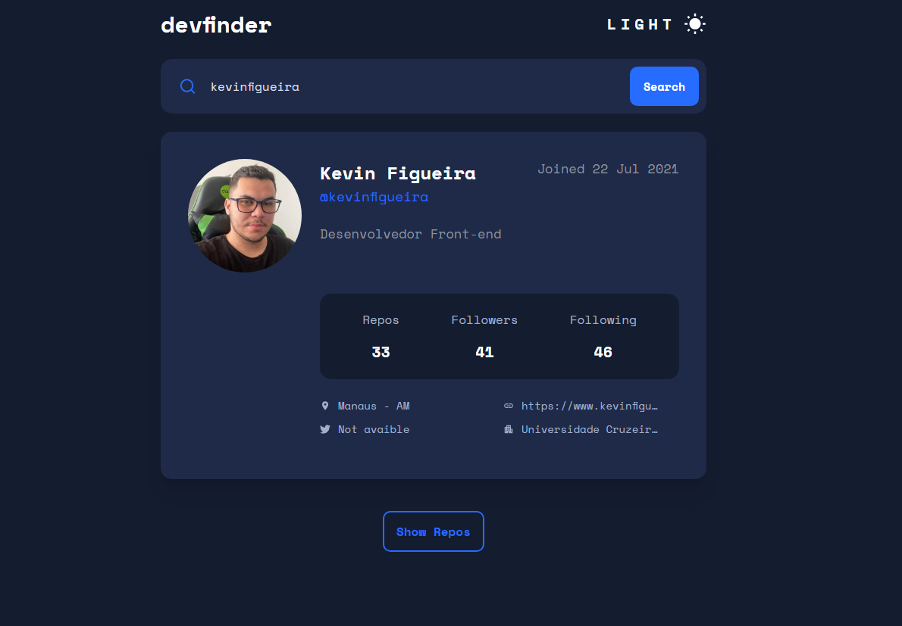

<div align="center" id="top"> 
  

  &#xa0;

  <!-- <a href="https://githubusersearch.netlify.app">Demo</a> -->
</div>

<h1 align="center">Github User Search</h1>

<p align="center">
  

  

  

  

  

  

   
</p>

<!-- Status -->

<!-- <h4 align="center"> 
	🚧  Github User Search 🚀 Under construction...  🚧
</h4> 

<hr> -->

<p align="center">
  <a href="#dart-about">About</a> &#xa0; | &#xa0; 
  <a href="#sparkles-features">Features</a> &#xa0; | &#xa0;
  <a href="#rocket-technologies">Technologies</a> &#xa0; | &#xa0;
  <a href="#white_check_mark-requirements">Requirements</a> &#xa0; | &#xa0;
  <a href="#checkered_flag-starting">Starting</a> &#xa0; | &#xa0;
  <a href="#memo-license">License</a> &#xa0; | &#xa0;
  <a href="https://github.com/kevinfigueira" target="_blank">Author</a>
</p>

<br>

## :dart: About ##

This project was designed to perform an intuitive search of Github profiles and repositories. The project is using the [Github Users API](https://docs.github.com/en/rest/guides/getting-started-with-the-rest-api), thinking about the usability of the users, a board is created with initial information about the profile and if there are repositories, it shows a button to show all repositories

## :sparkles: Features ##

:heavy_check_mark: Shows all necessary profile information;
:heavy_check_mark: Show all repository;
:heavy_check_mark: Dark and Light mode;
:heavy_check_mark: Responsive App;

## :rocket: Technologies ##

The following tools were used in this project:

- [Vite](https://vitejs.dev/)
- [Node.js](https://nodejs.org/en/)
- [React](https://pt-br.reactjs.org/)
- [TypeScript](https://www.typescriptlang.org/)
- [Axios](https://axios-http.com/ptbr/)
- [Styled-Components](https://styled-components.com/)
- [React-icon](https://react-icons.github.io/react-icons/)

## :white_check_mark: Requirements ##

Before starting :checkered_flag:, you need to have [Git](https://git-scm.com) and [Node](https://nodejs.org/en/) installed.

## :checkered_flag: Starting ##

```bash
# Clone this project
$ git clone https://github.com/kevinfigueira/github-user-search

# Access
$ cd github-user-search

# Install dependencies
$ npm install

# Run the project
$ npm run dev

# The server will initialize in the <http://localhost:3000>
```

## :memo: License ##

This project is under license from MIT. For more details, see the [LICENSE](LICENSE.md) file.


Made with :heart: by <a href="https://github.com/kevinfigueira" target="_blank">Kevin Figueira</a>

&#xa0;

<a href="#top">Back to top</a>
